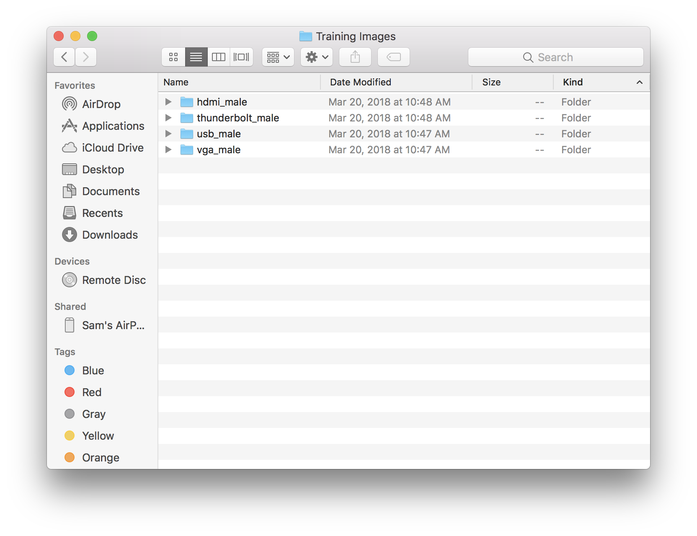
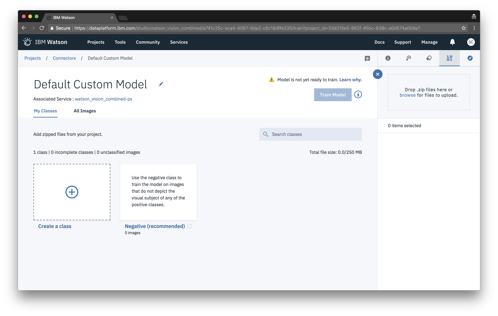
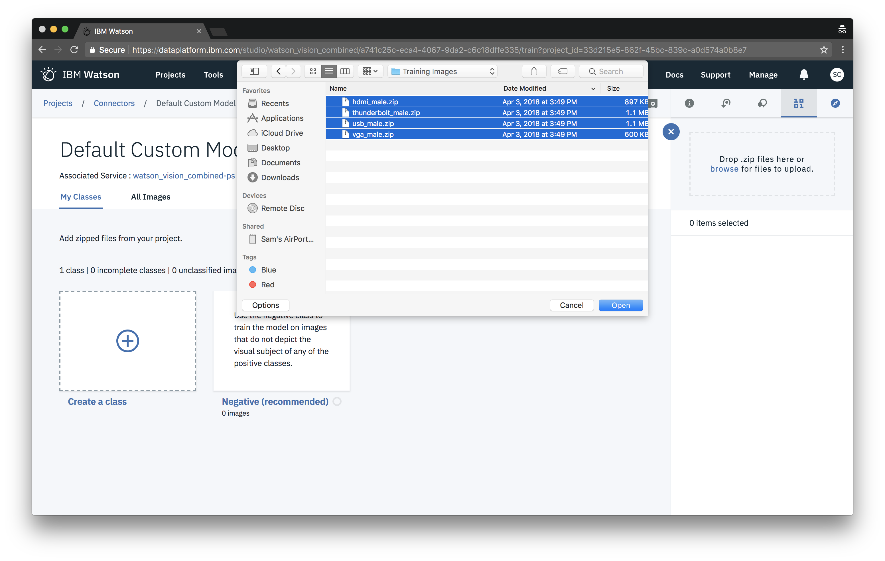
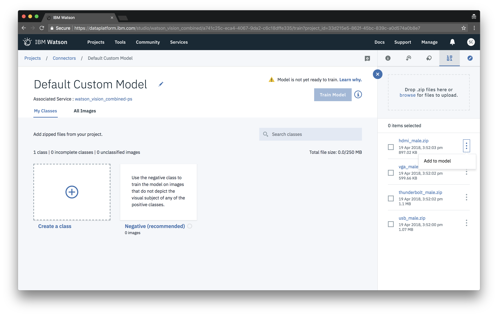
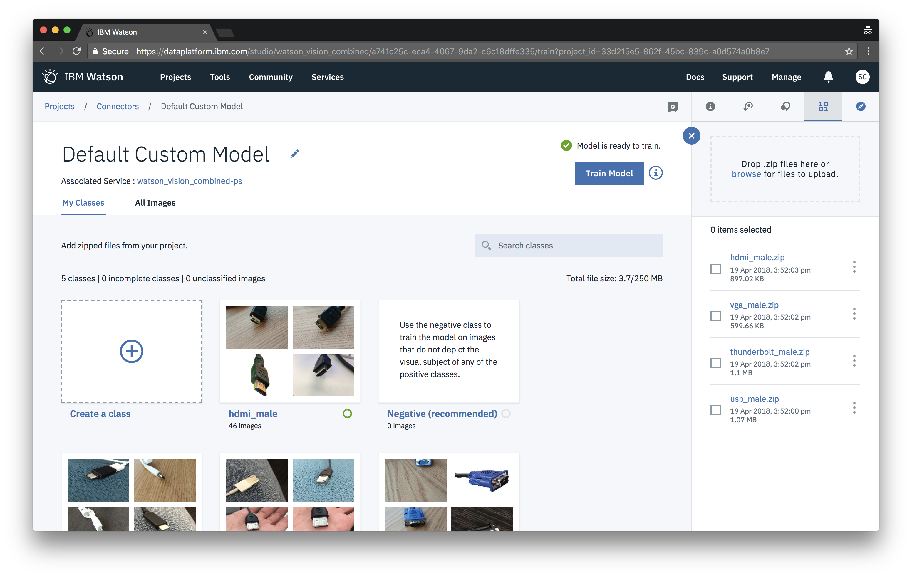

In order to create our model, we have to provide training images to the classifier. Take a few minutes to take photos of the cables to prepare our data.

Make sure to take *at least* **10** images of each cable. For best results, change the background, lighting, and any other variables that you can think of! (Once you're done taking photos, use airdrop to transfer the images to your computer)

# Preparing our data
Now we need to prepare our data by classifying each image.
1. Create an empty folder for each *type* of cable

1. Sort through your images, putting each in the correct folder based on the type of cable.
1. Once all of your images are in the correct folder, archive each folder to create individual *.zip* files (the name of each zip file will eventually become the classifier names) ***Note: on OS X, "compress" is used to create a .zip***

1. Now let's return to our **Custom Model Dashboard**

1. On the right side, click **browse** to select the .zip files we just created (if you hold *shift*, you can select multiple files at once). Click the **open** button.

1. It will take a moment for the zips to be uploaded, once they are ready, click the three dots next to the files and click **Add to model** for each .zip file

1. Allow a few moments for the files to be added to the model. The tooling will automatically create a class for the set of images based on the names of the .zip files. Once the images are done loading you can click **Train Model** in the upper right corner. Please allow a few minutes for the model to train.

